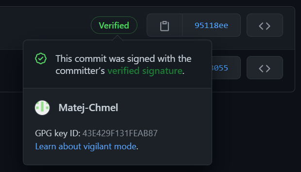

# How to sign your commits

## Install GPG

Choose the appropriate program from the table below based on your OS.

|OS|Link / command|
|---|---|
|Windows|[Gpg4win](https://gpg4win.org/download.html)|
|Termux|`pkg install gnupg`|
|Other|[Gnupg](https://gnupg.org/download/)|

## Check installation

Run:

```bash
gpg --version
```

If the system cannot find the program, add it to path.
On Windows it's usually installed in *C:\Program Files (x86)\GnuPG\bin*.

## Create your key

- Run:

```bash
gpg --full-gen-key
```

- Select option 4, RSA.
- Type 4096 for maximum length.
- Type 0 so the key never expires.
- Confirm.
- Enter your GitHub account name.
- Enter your GitHub no-reply email.
- You can skip the Comment entry by pressing Enter.
- Okay.
- Think of a passphrase and enter it.
The passphrase must consist of at least 8 characters,
one of which must be a number or special character.

## Get your signing key

Run:

```bash
gpg --list-keys --keyid-format long
```

Find your name in the output table and
copy the 16-digit number right after `rsa4096/`.

## Attach the key to git

Run:

```bash
git config --global user.signingkey {YOUR SIGNING KEY}
```

To check that it was attached correctly run:

```bash
git config --global --list
```

You should see your key somewhere in the output.

## Get your public key

Run:

```bash
gpg --armor --export {YOUR SIGNING KEY}
```

This will output a very long string similar to this one:

```bash
-----BEGIN PGP PUBLIC KEY BLOCK-----
...
-----END PGP PUBLIC KEY BLOCK-----
```

Copy it to clipboard.

## Add the key to GitHub

Open [Add new GPG key](https://github.com/settings/gpg/new) in the browser.
Paste your key in the text area and click on *Add GPG key*.

## Always require signature

If you plan to sign all your future commits, require every commit to be signed.
Run:

```bash
git config --global commit.gpgsign true
```

This is especially useful when using IDEs that don't have their own option for signing commits like Visual Studio.

## VS Code

If you use VS Code as your editor,
go to settings and enable option *Git: Enable commit signing*.

## Push a commit

After attempting to push a commit to any repository,
git should ask you for your passphrase with which you created the key.

After successully pushing a commit,
you should see a verified badge on the *Commits* page of the repository you pushed to.



# Known issues

## Missing passphrase dialog

If the git hangs while committing or GPG throws an error without showing a dialog where you could enter the passphrase, try the following.

### Windows

Before committing your work, run GPG Agent in the background. Start it with the Batch script below.

```batch
@echo off
gpg-agent --daemon --verbose
```

You should see a command prompt window monitoring access to GPG client. When committing you should see new entry.

If you want to sign multiple commits, leave GPG Agent open until you sign them all.

### Termux, Linux

Add new environment variable with this command.

```bash
export GPG_TTY=$(tty)
```
